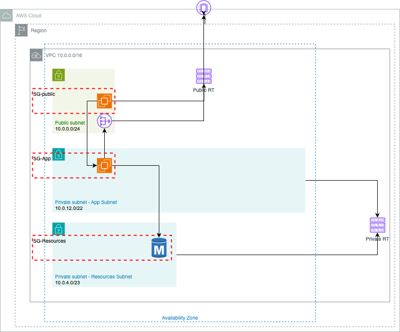
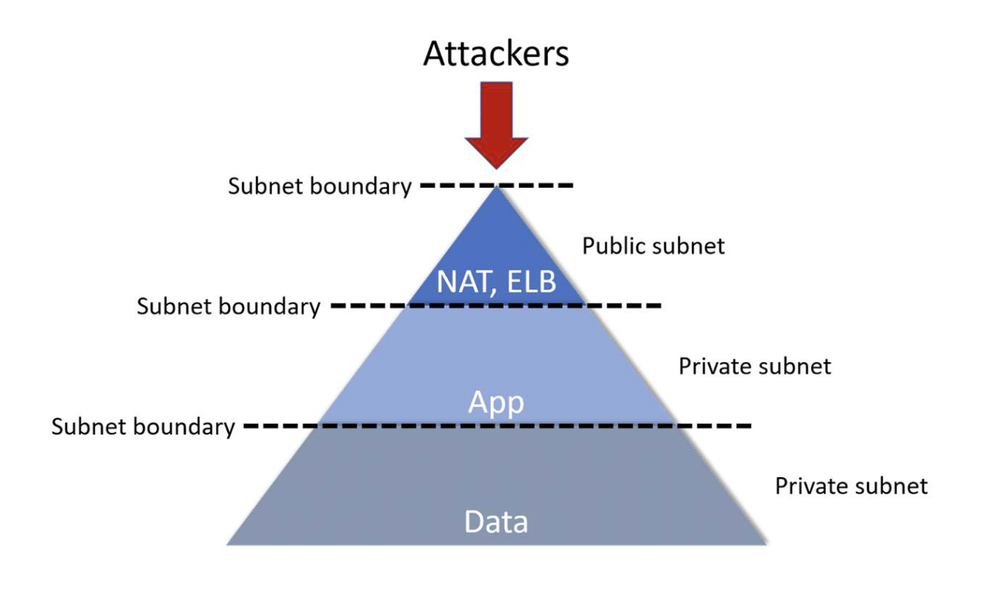
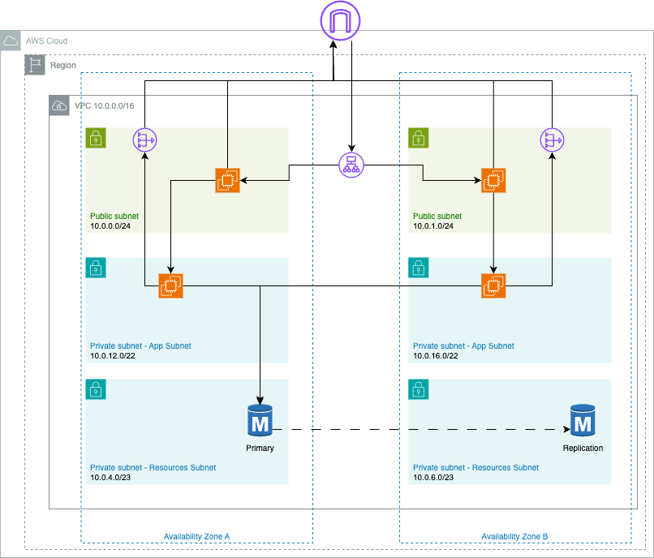

# Solution

The proposed solution is based on the multi-tier architecture pattern, where the VPC is divided into three layers: public, private, and data. The public layer is responsible for hosting the consumer facing resources, the private layer is responsible for hosting the application servers, and the data layer is responsible for hosting the database servers.

The diagram below shows the proposed solution:

This is a very common pattern in cloud computing, as it allows for a clear separation of concerns and a better security posture; since the public layer is the only one that has direct access to the internet, the private layer can only communicate with the public layer, and the data layer can only communicate with the private layer.

## Design

### CIDR Specification

As specified in the requirements, the VPC will be a 10.0.0.0/16 [CIDR](cidr.md) block, which allows for 65,536 IP addresses.

Each subnet will use subranges of the VPC CIDR block, as follows:

- Public subnet: 10.0.0.0/24 (254 IP addresses) 
- Private App subnet: 10.0.12.0/22 (1022 IP addresses)
- Private DB subnet: 10.0.4.0/23 (510 IP addresses)

The public subnet is the smaller one, as it is a best practice to have as few resources as possible in the public layer, to reduce the attack surface.

The private app subnet is the largest one, as it will host the application servers, which are the most numerous resources commonly found in the architecture patterns.

The private DB subnet is the second largest one, as it will host the database servers, which are shared resources that are not as numerous as the application servers.

### Internet Access

As mentioned earlier, the public subnet is the only one that has direct access to the internet. This is achieved by attaching an Internet Gateway to the VPC and associating it with the public route table.

The private subnets do not have direct access to the internet, but they can communicate with it through a NAT Gateway.

The NAT Gateway redirects the traffic from the private subnets to the Internet Gateway. As a translation device, it allows the private resources to initiate outbound connections to the internet, but it does not allow inbound connections from the internet.

### Route Tables

In this cenario, we need two route tables: one for the public subnet and one for the private subnets.

A route table is a set of rules, called routes, that are used to determine where network traffic is directed. Each subnet in a VPC must be associated with a route table.

A public subnet is associated with a route table that has a route to the Internet Gateway, and a private subnet is associated with a route table that has a route to the NAT Gateway.

|Route Table| Destination | Target | Description |
|---|---|---|---|
|Public-RT|10.0.0.0/16|local|Local traffic within the VPC|
|Public-RT|0.0.0.0/0|IGW|Internet Gateway|
|Private-RT|10.0.0.0/16|local|Local traffic within the VPC|
|Private-RT|0.0.0.0/0|NATGW|NAT Gateway|

### Security Groups

A security group acts as a virtual firewall that controls the traffic for one or more instances.

The security groups retrict access to database instances only from resources available in the private application subnet.
The access to application instances is restricted to resources from the public subnet.
The access to public instances is open to the internet.

#### Inbound Rules:
|Security Group| Source | Protocol | Port | Description |
|---|---|---|---|---|
|public-sg|0.0.0.0/0|ICMP|*|ping|
|public-sg|0.0.0.0/0|TCP|22|ssh|
|app-sg|10.0.0.0/24|TCP|22|ssh|
|app-sg|10.0.0.0/24|ICMP|*|ping|
|resources-sg|10.0.12.0/22|TCP|5432|PostgreSQL|
|resources-sg|10.0.12.0/22|ICMP|*|ping|

#### Outubound Rules:

All security groups allow all outbound traffic to all destinations.

## Resilient Alternative

To make the solution more resilient, we can duplicate the subnets in a different availability zone. This way, if one AZ fails, the resources can be automatically redirected to another AZ. 

This can be achieved by adding an Application Load Balancer to distribute the traffic between the instances in the different AZs and enabling the data replication feature in the RDS instance.

The security groups will need to be updated to allow traffic between the instances in the different AZs.

## Steps

Access the [steps.md](./steps.md) file to see the detailed steps to implement the proposed solution.