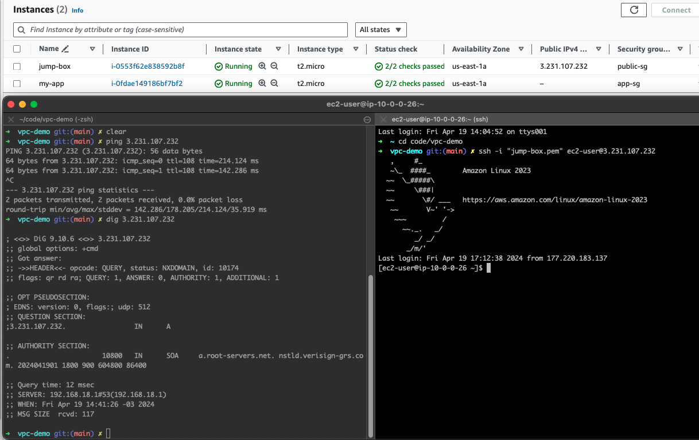
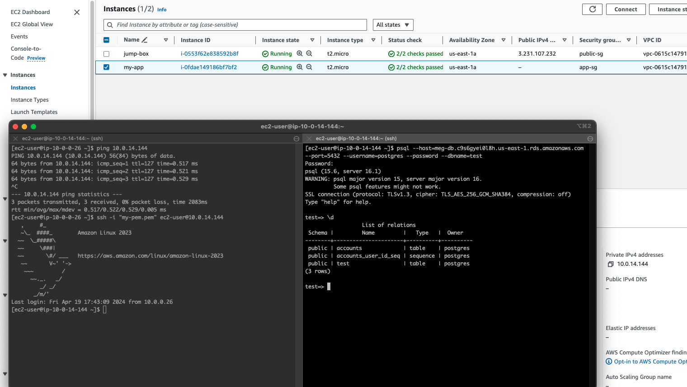

# Validations

Instância iniciada em subnet pública possui IP público e conexão com a internet validados via ping, dig e traceroute. 

Instância iniciada em subnet privada possui apenas ip privado, se comunica com a instância pública via rede privada ( ping + telnet ), essa instância também consegue se comunicar com um banco de dados lançado em outra subnet privada ( ping + telnet ). 

